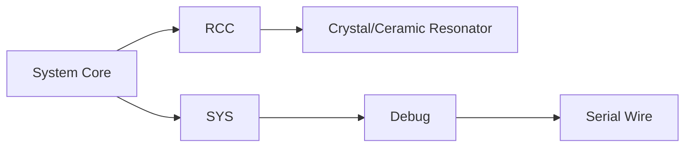

1. 引脚连接
OLED模块       STM32开发板
GND  ---------- GND
VCC  ---------- 3.3V
SCL  ---------- PB6
SDA  ---------- PB7
# STM32CubeMX配置
1. 创建新工程
打开STM32CubeMX，选择对应芯片型号（如STM32F103C8T6）
配置系统时钟，确保主频设置正确（如72MHz）

2. 时钟树配置
配置HCLK为72MHz
确保IIC时钟源正确配置
3. IIC外设配置
在"Connectivity"中找到"I2C1"
设置模式为"I2C"
配置为快速模式（Fast Mode）
确认引脚自动分配为PB6(SCL)和PB7(SDA)
设置IIC时钟频率为400kHz
4. 生成代码
设置工程名称和路径
选择CMake作为IDE
勾选"Generate peripheral initialization as a pair of '.c/.h' files per peripheral"
点击"GENERATE CODE"生成工程
