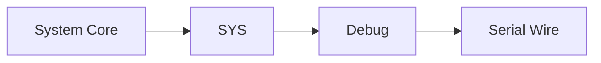
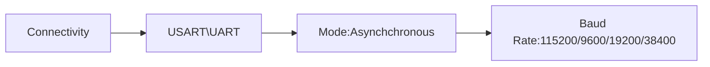

# TTl串口（STM32）
1. TX发送高低电平（0,1），RX接受，TX接RX，RX接TX，GND共地（水平线一致）。
2. CcbeMX配置

3. 代码编写 （STM32发数据给电脑）
char mmessage[]="hello world";
while(1)死循环中
*HAL_UART_Transmit*(&huart2,*(uint8_t*) message,strlen(message),HAL_MAX_DELAY(0xFFFFFFFF));
HAL_Delay(1000);//1秒发送一次

电脑发数据给STM32
uint8_t Date[2];
*HAL_UART_Receive*(&huart2,Date,2,100);
3. USB转TTL
4. 波特律动串口助手